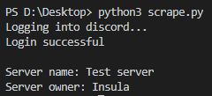

# Server-owner
Find the owner of a Discord server

Installation:

<li>$ git clone https://github.com/Insula415/server-owner</li>
<li>$ pip3 install -r requirements.txt</li>
<li>$ python3 scrape.py</li>

<strong>Make sure you have selenium set up and your Discord credentials are in the "secrets.py" file.<strong> 
  <strong><i>Instructions for selenium setup are located in "setup.txt"</i></strong>
